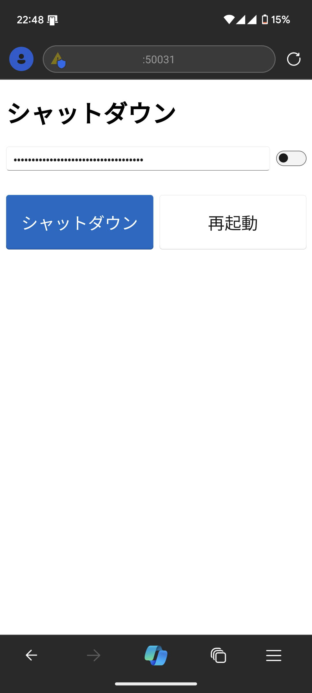

# remote-shutdown
対象 PC と同一 LAN 上にあるスマホや PC から、シャットダウンまたは再起動ができるウェブアプリ兼サーバーです。

## インストール方法
https://github.com/Himeyama/remote-shutdown/releases よりインストーラーをダウンロードし、インストールを行います。

PC 起動時にアプリ (サーバー) が起動します。

> [!NOTE]
> `Win` + `R` のファイル名を指定して実行で `shell:startup` を実行するとショートカットがあります。

## セットアップ
アプリをインストールした PC で http://127.0.0.1:50031 にアクセスすると、トークンと接続先 IP アドレスが得られます。
このトークンを使用して、シャットダウンまたは再起動が可能です。

初回起動時にファイアウォールが聞かれますが、有効にしてください。
有効にした場合、スマホまたは別の PC からアクセス可能になります。

> [!NOTE]
> 誤って無効にした場合、ファイル名を指定して実行 (`Win` + `R`) で `wf.msc` を実行し「受信」の remote_shutdown.exe の規則を削除し、再度アプリを実行してください。

スマホまたは別の PC からアプリがインストールされている PC に接続する場合は、上記のページに表示される IP アドレスを含むリンクにアクセスします。

## 使用法
アプリをインストールしている PC から得られたトークンを入力し、シャットダウンまたは再起動のボタンをクリックします。




## 開発環境
以下、開発者向けの説明です。

- Python 3.8.10 (pyenv install 3.8)
- Poetry (pip install poetry)

```bash
poetry shell # 仮想環境立ち上げ
poetry install # 依存パッケージインストール
```

## 実行

```bash
poetry run task build-script # スクリプトをコンパイル
poetry run task main # サーバー起動
```

## 実行ファイル作成
PyInstaller で実行ファイルを作成します。
PyInstaller そのものは、Poetry の仮想環境に含まれないので、pip 等でインストールしてください。

```bash
poetry run task build-script # Webpack
poetry run task build # PyInstaller で実行ファイル作成
```

## インストーラー作成
nsis を使用してインストーラーを作成します。

```bash
poetry run task pack
```